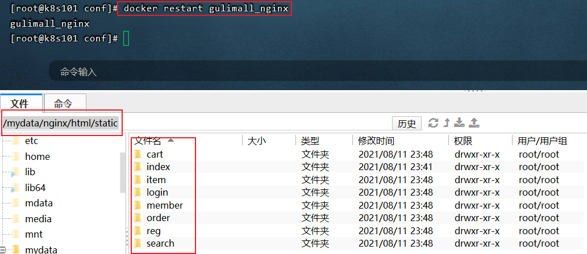

# 谷粒商城简介

### 前言

gulimall 项目致力于打造一个完整的电商系统，采用现阶段流行技术来实现，采用前后端分离继续编写。

### 项目API接口文档

- 文档地址：[https://easydoc.xyz/s/78237135/ZUqEdvA4/hKJTcbfd]()

### 项目介绍

gulimall（谷粒商城） 项目是一套电商项目，包括前台商城系统以及后台管理系统，基于 SpringCloud + SpringCloudAlibaba + MyBatis-Plus实现，采用 Docker 容器化部署。前台商城系统包括：用户登录、注册、商品搜索、商品详情、购物车、下订单流程、秒杀活动等模块。后台管理系统包括：系统管理、商品系统、优惠营销、库存系统、订单系统、用户系统、内容管理等七大模块。

### 项目演示

#### **前台部分功能演示效果**


#### 后端登录界面


#### 主页面（后端开发界面）


#### 后台部分功能

[](https://imgchr.com/i/UUvoXq)[](https://imgchr.com/i/UUvONF)[](https://imgchr.com/i/UUvHBV)[](https://imgchr.com/i/UUvIcn)

### 组织结构

```
gulimall
├── gulimall-common -- 工具类及通用代码
├── renren-generator -- 人人开源项目的代码生成器
├── gulimall-auth-server -- 认证中心（社交登录、OAuth2.0、单点登录）
├── gulimall-cart -- 购物车服务
├── gulimall-coupon -- 优惠卷服务
├── gulimall-gateway -- 统一配置网关
├── gulimall-order -- 订单服务
├── gulimall-product -- 商品服务
├── gulimall-search -- 检索服务
├── gulimall-seckill -- 秒杀服务
├── gulimall-third-party -- 第三方服务
├── gulimall-ware -- 仓储服务
└── gulimall-member -- 会员服务

```

### 技术选型

**后端技术**

|        技术        |           说明           |                      官网                       |
| :----------------: | :----------------------: | :---------------------------------------------: |
|     SpringBoot     |       容器+MVC框架       |     https://spring.io/projects/spring-boot      |
|    SpringCloud     |        微服务架构        |     https://spring.io/projects/spring-cloud     |
| SpringCloudAlibaba |        一系列组件        | https://spring.io/projects/spring-cloud-alibaba |
|    MyBatis-Plus    |         ORM框架          |             https://mp.baomidou.com             |
|  renren-generator  | 人人开源项目的代码生成器 |   https://gitee.com/renrenio/renren-generator   |
|   Elasticsearch    |         搜索引擎         |    https://github.com/elastic/elasticsearch     |
|      RabbitMQ      |         消息队列         |            https://www.rabbitmq.com             |
|   SpringSession    |        分布式缓存        |    https://projects.spring.io/spring-session    |
|      Redisson      |         分布式锁         |      https://github.com/redisson/redisson       |
|       Docker       |       应用容器引擎       |             https://www.docker.com              |
|        OSS         |        对象云存储        |  https://github.com/aliyun/aliyun-oss-java-sdk  |

**前端技术**

|   技术    |    说明    |           官网            |
| :-------: | :--------: | :-----------------------: |
|    Vue    |  前端框架  |     https://vuejs.org     |
|  Element  | 前端UI框架 | https://element.eleme.io  |
| thymeleaf |  模板引擎  | https://www.thymeleaf.org |
|  node.js  | 服务端的js |   https://nodejs.org/en   |

### 架构图

**系统架构图**

[](https://imgchr.com/i/UUvRAS)

**业务架构图**


### 环境搭建

#### 开发工具

|     工具      |        说明         |                      官网                       |
| :-----------: | :-----------------: | :---------------------------------------------: |
|     IDEA      |    开发Java程序     |     https://www.jetbrains.com/idea/download     |
| RedisDesktop  | redis客户端连接工具 |        https://redisdesktop.com/download        |
|  SwitchHosts  |    本地host管理     |       https://oldj.github.io/SwitchHosts        |
|    X-shell    |  Linux远程连接工具  | http://www.netsarang.com/download/software.html |
|    Navicat    |   数据库连接工具    |       http://www.formysql.com/xiazai.html       |
| PowerDesigner |   数据库设计工具    |             http://powerdesigner.de             |
|    Postman    |   API接口调试工具   |             https://www.postman.com             |
|    Jmeter     |    性能压测工具     |            https://jmeter.apache.org            |
|    Typora     |   Markdown编辑器    |                https://typora.io                |

#### 开发环境

|     工具      | 版本号 |                             下载                             |
| :-----------: | :----: | :----------------------------------------------------------: |
|      JDK      |  1.8   | https://www.oracle.com/java/technologies/javase/javase-jdk8-downloads.html |
|     Mysql     |  5.7   |                    https://www.mysql.com                     |
|     Redis     | Redis  |                  https://redis.io/download                   |
| Elasticsearch | 7.6.2  |               https://www.elastic.co/downloads               |
|    Kibana     | 7.6.2  |               https://www.elastic.co/cn/kibana               |
|   RabbitMQ    | 3.8.5  |            http://www.rabbitmq.com/download.html             |
|     Nginx     | 1.1.6  |              http://nginx.org/en/download.html               |

注意：以上的除了jdk都是采用docker方式进行安装，详细安装步骤可参考百度!!!

#### 搭建步骤

> Windows环境部署

- 修改本机的host文件，映射域名端口

```
192.168.168.50	gulimall.com
192.168.168.50	search.gulimall.com
192.168.168.50  item.gulimall.com
192.168.168.50  auth.gulimall.com
192.168.168.50  cart.gulimall.com
192.168.168.50  order.gulimall.com
192.168.168.50  member.gulimall.com
192.168.168.50  seckill.gulimall.com
以上端口换成自己Linux的ip地址
```

- 启动mysql

```shell
docker run --name gulimall_mysql -p 3306:3306 -e MYSQL_ROOT_PASSWORD=123456 -d -v /home/mysql/:/var/lib/mysql --restart=always mysql --lower_case_table_names=1
#登录mysql
docker exec -it gulimall_mysql /bin/bash
msyql -uroot -p123456
#导入sql文件，生成需要的数据库和表 文件（6个sql文件）在当前目录下，如下
resource/sql文件

```
- 启动redis
```shell
# 在虚拟机中
mkdir -p /mydata/redis/conf
touch /mydata/redis/conf/redis.conf

docker pull redis

docker run -p 6379:6379 --name redis \
-v /mydata/redis/data:/data \
-v /mydata/redis/conf/redis.conf:/etc/redis/redis.conf \
-d redis redis-server /etc/redis/redis.conf
#默认是不持久化的。在配置文件中输入appendonly yes，就可以aof持久化了
vim /mydata/redis/conf/redis.conf
# 写入下面内容
appendonly yes
# 保存

#重启
docker restart redis
#设置开机启动
docker update redis --restart=always

```

- 启动rabbitmq

```shell
docker run -d --name gulimall_rabbitmq --publish 5671:5671 --publish 5672:5672 --publish 4369:4369 --publish 25672:25672 --publish 15671:15671 --publish 15672:15672 rabbitmq:management
docker update gulimall_rabbitmq --restart=always
```

- 启动nginx：

```shell
#为了挂载，先启动一个nginx，进入容器，取出容器目录/etc/nginx/目录下的文件到linux的/mydata/nginx/conf/目录下，再删除nginx，重启一个添加挂载的nginx，如下：
docker run -d nginx
#73f6ccc2bc60是容器id
docker cp 73f6ccc2bc60:/etc/nginx/ /mydata/nginx/conf/
#删不了就加上 -f
docker rm 73f6ccc2bc60 -f
docker run --name  gulimall_nginx -d -p 80:80 -v /mydata/nginx/conf/:/etc/nginx/ -v /mydata/nginx/html:/usr/share/nginx/html nginx
docker update nginx --restart=always

cd /mydata/nginx/html/
vim index.html
##随便写写 
## 下面修改nginx的配置，每次配置完要重启nginx
docker restart gulimall_nginx
##测试 http://192.168.168.50:80
```

- 修改Linux中Nginx的配置文件

```shell
#1、在nginx.conf文件中的http块中添加负载均衡的配置  在目录 /mydata/nginx/conf/下
upstream gulimall {
        #gulimall服务所在的机器（我这里是启在window上，ip为172.20.25.124）
        server 172.20.25.124:88;
    }
#2、在gulimall.conf中添加如下配置   在目录 /mydata/nginx/conf/conf.d/ 下新建  gulimall.conf
# /mydata/nginx/conf/conf.d/下的所有文件内容 会默认 合并到nginx.conf文件
server {
    listen       80;
    server_name  gulimall.com  *.gulimall.com hjl.mynatapp.cc;

    #charset koi8-r;
    #access_log  /var/log/nginx/log/host.access.log  main;

    #配置静态资源的动态分离
    location /static/ {
        # 这是nginx容器的目录，已挂载到linux的/mydata/nginx/html目录下
        root   /usr/share/nginx/html; 
    }

    #支付异步回调的一个配置
    location /payed/ {
        proxy_set_header Host order.gulimall.com;  #不让请求头丢失
        proxy_pass http://gulimall;
    }

    location / {
        #root   /usr/share/nginx/html;
        #index  index.html index.htm;
        proxy_set_header Host $host;     #不让请求头丢失
        proxy_pass http://gulimall;
    }
}
```
- 动静分离
- 将静态文件放入目录 /mydata/nginx/html/static/ 下，实现nginx的动静分离



- 克隆前端项目 `renren-fast-vue` 以 `npm run dev` 方式去运行
- 将html静态文件存放到nginx的指定目录下：/mydata/nginx/html/static/
- 克隆整个后端项目 `gulimall` ，并导入 IDEA 中完成编译

#### Nacos环境搭建
https://blog.csdn.net/xiaotian5180/article/details/105478543

- 源码下载：
```shell
git clone https://github.com/alibaba/nacos.git
```
- 编译：
```shell
mvn -Prelease-nacos -Dmaven.test.skip=true clean install -U
```
- 启动参数配置：
nacos默认使用的是集群方式，启动时会到默认的配置路径下，寻找集群配置文件cluster.conf。 我们源码运行时，通常使用的是单机模式，因此需要在启动参数中进行设置，在jvm的启动参数中，添加-Dnacos.standalone=true

- 启动：进入到nacos-console模块下的com.alibaba.nacos.Nacos类
- 启动成功后访问：
http://localhost:8848/nacos/index.html 登录名/密码：nacos/nacos
  

#### 前端搭建

- 打开前端工程（二选其一）：
  
  renren-fast-vue（如果是自己搭建，从头开始搭建前端代码）
  
  gulimall-admin-vue-app（如果想省事，直接使用完整前端代码）

- 安装node：
http://nodejs.cn/download/ 选择windows下载。下载完安装。 或者直接使用v12的版本（不要用12.0，可以用12.1）到这里下载：
https://npm.taobao.org/mirrors/node/

- NPM是随同NodeJS一起安装的包管理工具。JavaScript-NPM类似于java-Maven。

- 命令行输入node -v 检查配置好了，配置npm的镜像仓库地址，再执行
```shell
node -v
npm config set registry http://registry.npm.taobao.org/
```
- 然后去VSCode的项目终端中输入 npm install，是要去拉取依赖（package.json类似于pom.xml的dependency），但是会报错，然后进行如下操作：

- 启动fast-vue项目
```shell
npm install
npm run dev
```
- 如果有报错：结合下面的报错 npm install报错问题
https://blog.csdn.net/hancoder/article/details/113821646


- 项目首页：
http://gulimall.com/

